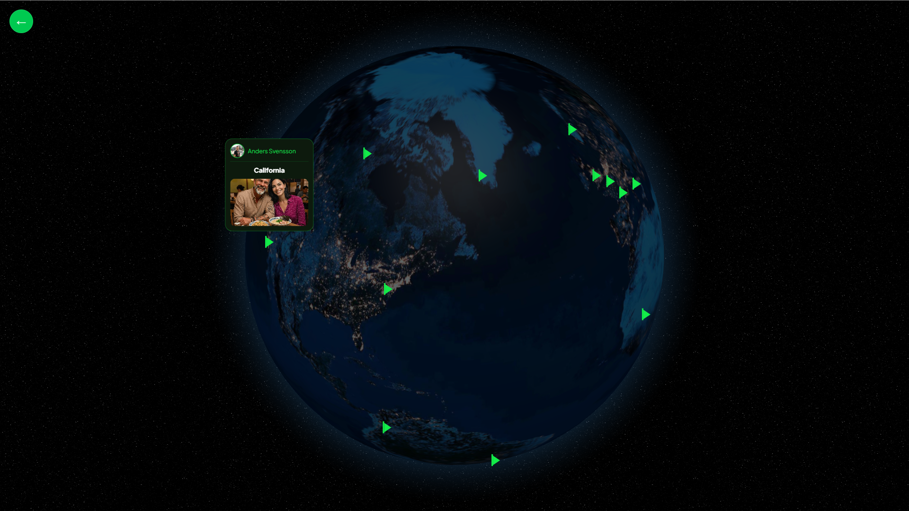
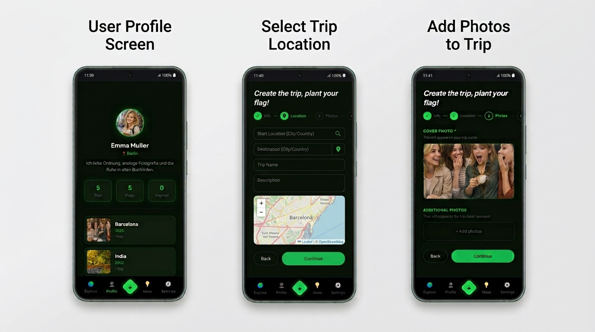

# 🌍 Waz Here

**Waz Here** is a travel diary web application I designed and built with **React and TypeScript**, combining travel memories with an interactive geographic experience.

Users can create travel entries, add photos and locations, manage their profile, and explore their saved trips through an interactive 3D globe.

<div align="center">
  
</div>

<div align="center">
  
</div>

[](https://waz-here.vercel.app/)

---

## ✨ Features

- **User profiles** — Manage profile information and personal travel data.
- **Trip creation** — Create new trips with destination, description and additional information.
- **Photo upload** — Add images to travel entries.
- **Geolocation** — Select trip coordinates through an interactive Leaflet map.
- **Interactive globe** — Explore saved trips through geographic markers on a 3D globe.
- **Trip details** — Open a marker to view information about a specific trip.
- **Responsive interface** — Adapted to different screen sizes.
- **Mobile First** — Designed with the mobile experience as the starting point.

## 🛠️ Tech Stack

| Category | Technology |
|---|---|
| Frontend | React 19, TypeScript |
| Build Tool | Vite |
| Styling | Tailwind CSS |
| Routing | React Router |
| Backend | Supabase |
| 3D Globe | React Globe GL |
| Maps | Leaflet, React Leaflet |
| Animations | Framer Motion |
| Icons | Lucide React |
| Testing | Vitest |

## 📱 Mobile First

Waz Here was designed following a **Mobile First** approach, focusing on the mobile experience as the starting point for the interface.

The responsive layout adapts the application to larger screens while maintaining the same core functionality across devices.

## 🗺️ Interactive Geography

One of the main features of Waz Here is its geographic experience.

Trips are associated with latitude and longitude coordinates and displayed as interactive markers on a 3D globe. Selecting a marker opens the corresponding trip information.

When creating a trip, users can also select its location directly through a **Leaflet** map.

## 💡 Project Concept

Waz Here started as a personal project idea to combine travel memories with an interactive geographic experience.

The application brings together profiles, trip creation, photos, maps and a 3D globe to create a visual way of recording and revisiting travel experiences.

## ⚙️ Installation

1. Clone the repository:

   ```bash
   git clone https://github.com/triflip/Waz-Here.git
   cd Waz-Here
